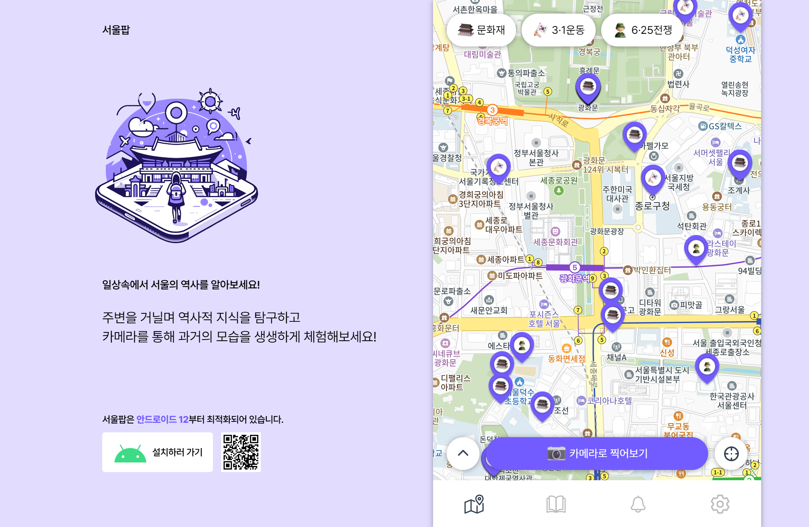

[//]: # ''



## 💬 프로젝트 소개

<b>서울 역사 정보 지도</b>  
사용자와 근접한 문화재 및 사적지의 푸시 알림을 받고,  
AR 카메라로 과거의 모습을 조회하여 역사에 대한 관심을 고취하는 서비스입니다.

---

## 📚 목차

- [🎯 기획 배경](#plans)
- [🙇 팀원 소개](#members)
- [🔨 기술 스택](#skills)
- [🚀 실행 방법 및 배포 주소](#installation)
- [💡 주요 기능 및 역할](#features)

---

<a name="plans"></a>

## 🎯 기획 배경

역사에 관심은 많지만, 바쁜 현대사회에서 찾아볼 시간이 부족한 사람들에게 쉽고 인터렉티브하게 역사 정보를 제공하고자 하였습니다.

---

<a name="members"></a>

## 🙇 팀원 소개

| [박지영](https://github.com/parkyolo) | [박진아](https://github.com/dev-hamster) | [서범석](https://github.com/beomxtone) |
| :-: | :-: | :-: |
|  |  |  |

---

<a name="skills"></a>

## 🔨 기술 스택

- Language: `Typescript`
- Core: `React`
- Styling: `Emotion`
- State: `React-Query`, `Zustand`
- etc: `Ar.js`, `Aframe`, `Capacitor`

---

<a name="installation"></a>

## 🚀 실행 방법 및 배포 주소

```
// 패키지 라이브러리 설치
pnpm install

// 개발 환경 실행
pnpm dev

// 빌드 파일 생성
pnpm build
```

- 📱 front-domain : https://seoul-pop.com
- 🛠 back-server : https://api.seoul-pop.com
- 🔗 back-swagger : https://api.seoul-pop.com/swagger-ui/index.html#

---

<a name="features"></a>

## 💡 주요 기능 및 역할

### 🗺 역사 지도 - `박지영`, `서범석`

230여 개의 문화재, 90여 개의 3.1운동 및 6.25 전쟁 사적지에 대해 위치 정보와 경로 안내를 제공합니다.

| 역사 지도 | 경로 안내 |
| :-: | :-: |
|  |  |

### 📷 ar 역사 정보 - `박진아`

주변에 있는 역사 정보를 ar 컨텐츠로 띄어줍니다.

|                    ar 역사 정보                    |
| :------------------------------------------------: |
|  |

### 🔔 주변 역사 알림 - `박지영`

백그라운드 실시간 위치 데이터를 기반으로 인접한 역사 정보가 있으면 사용자에게 알림을 보냅니다.

| 주변 역사 알림 | 안 읽은 알림 확인 |
| :-: | :-: |
|  |  |

### 📙 도감 - `박지영`

ar 카메라를 통해 확인한 역사 정보를 모아봅니다.

|                           도감                           |
| :------------------------------------------------------: |
|  |

### ⚙ 권한 설정 - `박지영`

앱에서 위치, 알림 권한을 허용합니다.

|                     권한 설정                      |
| :------------------------------------------------: |
|  |

### 📂 폴더 구조 및 아키텍처 설계 - `서범석`

```
.
├── node_modules
├── public
└── src
    ├── api
    ├── components
    ├── constants
    ├── containers
    ├── hooks
    │   ├── server
    │   └── store
    ├── pages
    ├── router
    ├── styles
    ├── types
    └── utils

```
